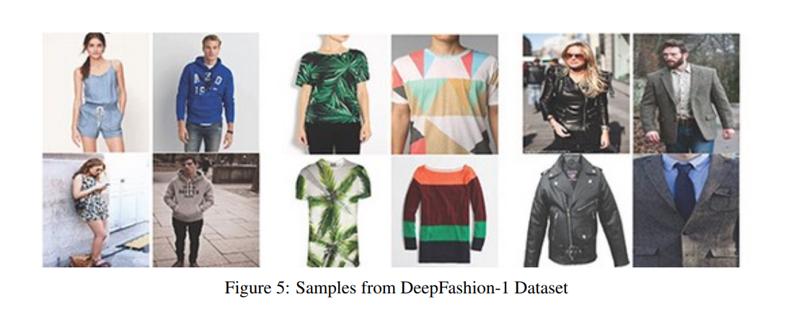
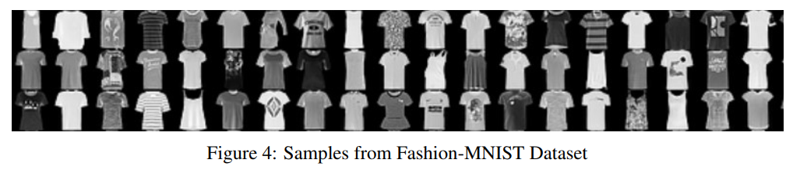
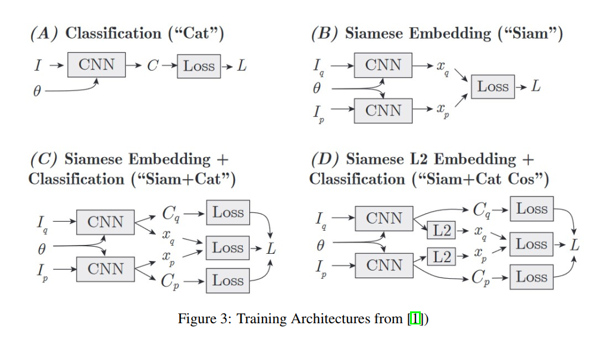
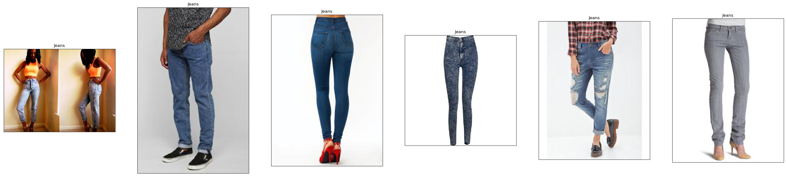
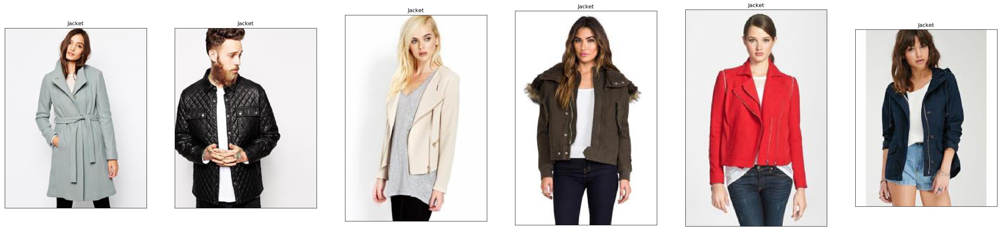
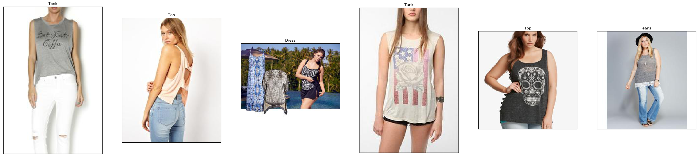

# Data Science Project
This project is aimed to implement methods to identify similar fashion images. We do this by applying the methods described in the paper [Learning visual similarity for product design with convolutional neural networks](https://dl.acm.org/doi/pdf/10.1145/2766959). 

We evaluate our methods on FashionMNIST and DeepFashion datasets.


## Methods
We aim to achieve the following for our project:
- Train a similarity vector space where similar fashion images are clustered together and different fashion images are separated away
- Input unseen fashion images on our trained Siamese network to query other similar fashion images from the similarity vector space
- Explore the trained similarity vector space
- Further train our Siamese network with more class labels and check if it is still able to create a reasonable similarity vector space

Following networks have been explored:


### Commands
------------------
1. Download the image data
```bash
$ scripts/download_deepfashion_ds.sh
```
2. Build the metadata csv
```bash
$ scripts/create_deepfashion_meta.py
```
3. Train specific model
```bash
$ python train_siamcat.py
```
### Some Results
**First Image is the query image**




